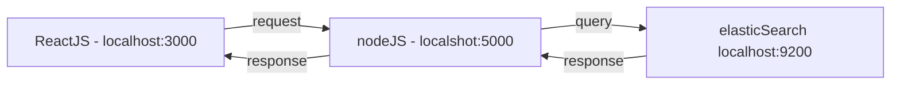

# ReactJS + NodeJS + ElasticSearch

This project allows to use the ElasticSearch functionnalities using javascript:
  - Create an index
  - Set Mapping data
  - Search data

## Requirements

In order to start working with nodeJS and ElasticSearch, you have to installe the following verions:
> node v12.16.3

> elasticSearch v6.5.4 ( https://www.elastic.co/fr/downloads/elasticsearch )

### package.json 
    "react": "^16.13.1",
    "react-dom": "^16.13.1",
    "react-scripts": "3.4.1"
    "elasticsearch": "^16.7.1",
    "express": "^4.16.4"
    
You will have to install kibana (if you want to visualize your data):

> https://www.elastic.co/fr/downloads/kibana

## Start app
This command will start the client and the server app at the same time. The url for the client is : localhost:3000 and the url for the server is localhost:5000

## Contribution
Please feel free to contribute new functionalities or any improvements.
